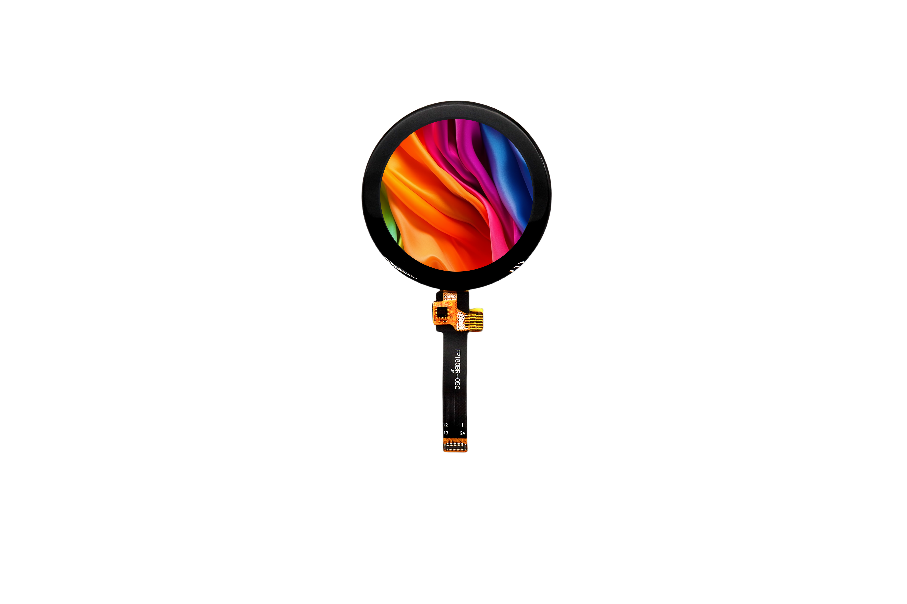

<p align="left"></p>

<h1 align="center">OSPTEK 1.8″ TFT 360×360 (ST77916 · QSPI)</h1>

<p align="center"><b>Round TFT · QSPI · ST77916</b></p>

<p align="center"><a href="./README.md">简体中文</a> | English · <a href="../../README_EN.md">Family index</a></p>

<p align="center">
  
  
  
  
</p>

<p align="center"></p>

## Contents

- [Overview](#overview)
- [Specifications](#specifications)
- [Repository layout](#repository-layout)
- [Resources](#resources)
- [Buy](#buy)
- [Support](#support)

---

## Overview

OSPTEK **1.8″ 360×360 TFT** is a **QSPI** round color display module driven by **ST77916**, with touch **CST816D**.

Spec ID (repository name): `tft-1.8-360x360-qspi-st77916`

Current module version: **YDP180BT007-V3**. Electrical and mechanical details follow [`docs/YDP180BT007-V3.pdf`](./docs/YDP180BT007-V3.pdf).

## Specifications

| Item | Spec |
| ---- | ---- |
| Size | 1.8 inch |
| Type | TFT (round IPS) |
| Resolution | 360×360 |
| Interface | QSPI |
| Driver IC | ST77916 |
| Touch driver | CST816D |

> Full outline, FPC definition, power, and timing follow the product datasheet / driver IC datasheet.

## Repository layout

```text
tft-1.8-360x360-qspi-st77916/             # repo root (nav: ../../README_EN.md)
└── versions/
    └── YDP180BT007-V3/                      # full materials for this part number
        ├── README.md
        ├── README_EN.md
        ├── images/
        ├── docs/
        └── examples/
```

## Resources

### Product files

| Resource | Link |
| ---- | ---- |
| Outline drawing (YDP180BT007-V3) | [`docs/YDP180BT007-V3.pdf`](./docs/YDP180BT007-V3.pdf) |

## Buy

<p align="center">
  <a href="https://www.aliexpress.com/store/1105701619"></a>
  &nbsp;&nbsp;
  <a href="https://shop110742373.taobao.com/"></a>
</p>

**Overseas (AliExpress)**

- Store: [OSPTEK Official Store](https://www.aliexpress.com/store/1105701619)

**China (Taobao)**

- Store: [鱼鹰光电工厂店](https://shop110742373.taobao.com/)

## Support

- Technical support / product inquiry: <luyu@osptek.com>
- QQ group: **985881096**
- Website: <https://osptek.com/>
- Feel free to open an Issue in this repository with any questions

---

<p align="center"><sub>© 2026 OSPTEK · Materials in this repository are licensed under CC BY 4.0</sub></p>
